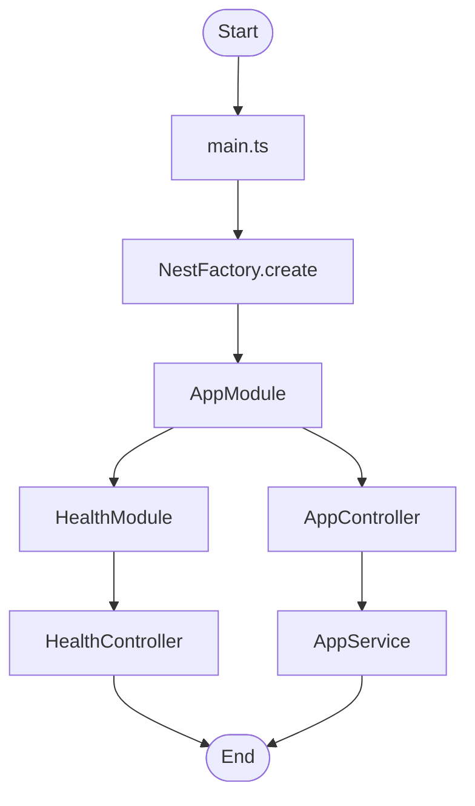
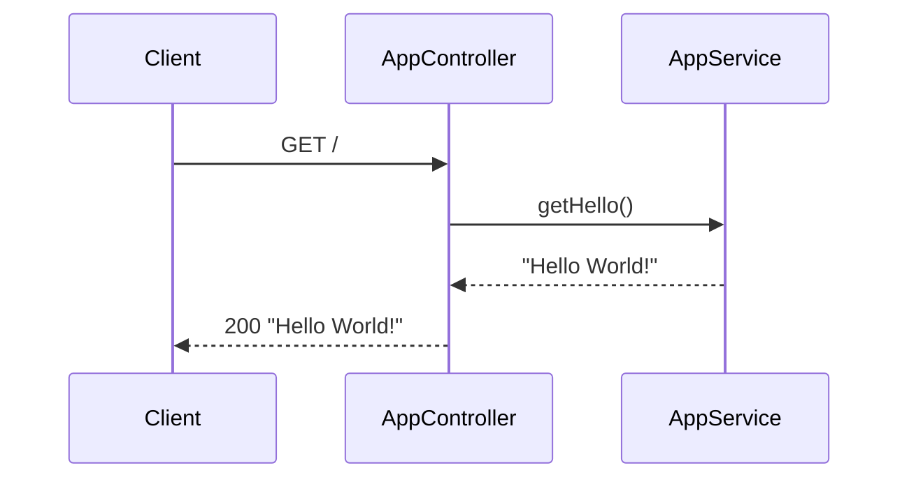
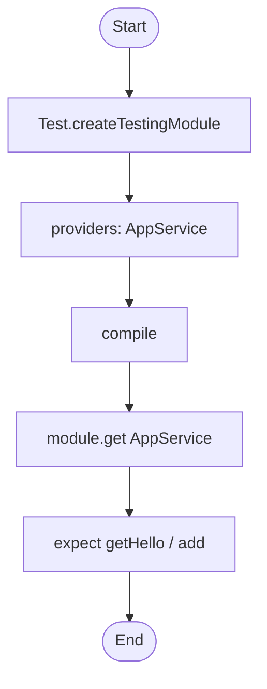
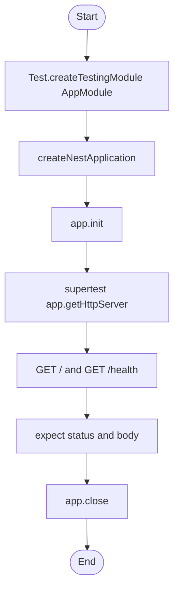

# Test Repo for Introduction to Testing in NestJS

A minimal NestJS application demonstrating **unit**, **integration**, and **end-to-end (E2E)** testing using **Jest** and **@nestjs/testing**. The project is fully typed in TypeScript and documented for maintainability.

## Overview

This repository provides a runnable NestJS backend with sample controllers and services. It illustrates how to test NestJS modules in isolation (unit tests), with minimal wiring (integration-style tests via the testing module), and through full HTTP stacks (E2E tests with Supertest).

## Features

- **Root API**: `GET /` returns a greeting string from `AppService`.
- **Health endpoint**: `GET /health` returns a JSON object with `status` and `timestamp` for monitoring.
- **Unit tests**: `AppService` and `AppController` are tested in isolation with mocked dependencies. `HealthController` is tested without HTTP.
- **E2E tests**: Full application is bootstrapped and `/` and `/health` are asserted via HTTP using Supertest.
- **TypeScript**: All source and test code use strict compiler options.
- **Documentation**: Inline documentation in the codebase follows a structured comment style.
- **Linting**: ESLint flat config in TypeScript (`eslint.config.mts`) with Prettier. It uses `jiti` to load the config.

## Prerequisites

- **Node.js**: v18 or later (LTS recommended).
- **npm**: v9 or later (or compatible package manager).

## Installation

From the project root:

```bash
cd test-repo-of-introduction-to-testing-in-NestJS
npm install
```

## Project Structure

```text
test-repo-of-introduction-to-testing-in-NestJS/
├── src/
│   ├── main.ts                 # Application entry point
│   ├── app.module.ts           # Root module
│   ├── app.controller.ts      # Root controller
│   ├── app.controller.spec.ts # Unit tests for AppController
│   ├── app.service.ts         # Root service
│   ├── app.service.spec.ts    # Unit tests for AppService
│   └── health/
│       ├── health.module.ts
│       ├── health.controller.ts
│       └── health.controller.spec.ts
├── test/
│   ├── jest-e2e.json          # Jest config for E2E tests
│   └── app.e2e-spec.ts        # E2E tests
├── package.json
├── tsconfig.json
├── tsconfig.build.json
├── nest-cli.json
├── jest.config.ts             # Jest config for unit/integration tests
├── eslint.config.mts          # ESLint flat config (TypeScript)
├── eslint-config.d.ts         # Type declaration for eslint-config-prettier
├── Doxyfile                   # Config for generating HTML docs from source
├── .gitignore
├── LICENSE
└── README.md
```

## Dependencies

### Runtime (production)

- `@nestjs/common`, `@nestjs/core`, `@nestjs/platform-express`: NestJS framework.
- `reflect-metadata`: Required for decorators.
- `rxjs`: Reactive extensions used by NestJS.

### Development

- `@nestjs/cli`: Nest CLI for build and start.
- `@nestjs/testing`: Testing utilities (`Test.createTestingModule`, etc.).
- `jest`, `ts-jest`: Test runner and TypeScript support.
- `supertest`, `@types/supertest`: HTTP assertions for E2E tests.
- `typescript`, `ts-node`, `tsconfig-paths`: TypeScript compilation and execution.
- `source-map-support`: Improves stack traces when running compiled output.
- `eslint`, `@typescript-eslint/*`, `eslint-config-prettier`, `eslint-plugin-prettier`: Linting and formatting.
- `jiti`: Loads the TypeScript ESLint config (`eslint.config.mts`) at runtime.
- `@types/node`, `@types/express`, `@types/jest`: Type definitions.

## Configuration

- **TypeScript**: `tsconfig.json` uses strict compiler options. `tsconfig.build.json` excludes `eslint.config.mts` and `jest.config.ts` from the Nest build so they are not type-checked with the app.
- **Jest (unit)**: `jest.config.ts` at the project root configures `rootDir: "src"`, `testRegex: ".*\\.spec\\.ts$"`, and `ts-jest` for unit and integration tests.
- **Jest (E2E)**: `test/jest-e2e.json` configures the E2E suite with `rootDir: "."` and `testRegex: ".e2e-spec.ts$"`.
- **ESLint**: `eslint.config.mts` is the flat config (TypeScript). ESLint loads it via `jiti`. `eslint-config.d.ts` declares types for `eslint-config-prettier`.
- **Nest**: `nest-cli.json` sets `sourceRoot` to `src` and uses the default Nest CLI behaviour. Build output is `dist/main.js` and sibling files under `dist/`.

## Running the Application

Start the server:

```bash
npm run start
```

The API will listen on `http://localhost:3000` (or the port set in the `PORT` environment variable). You can:

- Open `http://localhost:3000` in a browser or use `curl http://localhost:3000` to see the greeting.
- Call `GET http://localhost:3000/health` for the health check response.

For development with watch mode:

```bash
npm run start:dev
```

## Testing

### Unit and integration tests (Jest, `src/**/*.spec.ts`)

```bash
npm run test
```

This runs all `*.spec.ts` files under `src/` using `jest.config.ts`. Coverage report is generated with:

```bash
npm run test:cov
```

### E2E tests (Supertest, full app)

```bash
npm run test:e2e
```

This runs `test/app.e2e-spec.ts` using `test/jest-e2e.json`, starting the full `AppModule` and sending HTTP requests to `/` and `/health`.

## Testing and Debugging Guide

### Running a subset of tests

- Run tests in watch mode: `npm run test:watch`. Jest will re-run affected tests on file changes.
- Run tests for a single file: `npx jest src/app.service.spec.ts`.
- Run E2E only: `npm run test:e2e`.

### Debugging tests

- Use `npm run test:debug` to run Jest with Node inspector so you can attach a debugger (e.g. VS Code/Cursor “Jest: Debug” or Chrome DevTools).
- Add `debugger;` in a test or source file and start the debugger to break at that line.

### Debugging the application

- Start in debug mode: `npm run start:debug`. The Nest process will listen for a debugger on the default port. Attach your IDE or Chrome to it to step through `main.ts` and request handling.

### Common issues

- **Port in use**: Set `PORT=3001` (or another port) before `npm run start` or `npm run start:dev`.
- **Module not found**: Ensure `npm install` has been run and that imports use the same path style as the rest of the project (no `.js` extensions in imports for this setup).
- **Jest cannot find modules**: Ensure `jest.config.ts` and `test/jest-e2e.json` are not overwritten by a `jest` key in `package.json`. This project uses the config files.
- **start:prod fails or "Cannot find module"**: Run `npm run build` first. `start:prod` runs `node dist/main` and requires the `dist/` directory to exist.

## Code Change Summary

- **Added** `package.json` with NestJS, Jest, Supertest, TypeScript, and ESLint dependencies and scripts for start, start:prod, build, test, test:e2e, test:cov, lint, format, and doc. Includes `overrides` for `minimatch`, `glob`, `test-exclude`, and nested `@nestjs/cli` → `ajv` to address deprecations and vulnerabilities.
- **Added** `tsconfig.json` and `tsconfig.build.json` with strict options. The build excludes `eslint.config.mts` and `jest.config.ts`.
- **Added** `nest-cli.json` for the Nest CLI.
- **Added** `jest.config.ts` for unit/integration tests and `test/jest-e2e.json` for E2E tests.
- **Added** `eslint.config.mts` (TypeScript) for ESLint flat config with TypeScript and Prettier. `eslint-config.d.ts` declares module typings and `jiti` is used to load the config.
- **Added** `src/main.ts`, `src/app.module.ts`, `src/app.controller.ts`, `src/app.service.ts` and their unit tests (`*.spec.ts`).
- **Added** `src/health/health.module.ts`, `src/health/health.controller.ts` and `src/health/health.controller.spec.ts`.
- **Added** `test/app.e2e-spec.ts` for E2E tests using `Test.createTestingModule` and Supertest.
- **Updated** `README.md` with the sections above. `.gitignore` and `LICENSE` were already present.

## Architecture and Flow

### Application bootstrap



### Request flow for GET /



### Unit test flow (e.g. AppService)



### E2E test flow



## Scripts Reference

- **`npm run start`**: Start the application (single run).
- **`npm run start:dev`**: Start with watch mode for development.
- **`npm run start:debug`**: Start with debugger attached.
- **`npm run build`**: Compile TypeScript to `dist/`.
- **`npm run test`**: Run unit and integration tests (Jest).
- **`npm run test:watch`**: Run tests in watch mode.
- **`npm run test:cov`**: Run tests and generate coverage report.
- **`npm run test:e2e`**: Run end-to-end tests.
- **`npm run test:debug`**: Run Jest with Node inspector for debugging.
- **`npm run lint`**: Run ESLint on `src` and `test`.
- **`npm run format`**: Run Prettier on `src` and `test` TypeScript files.
- **`npm run doc`**: Generate HTML documentation from source.

## Linting and Formatting

- **Lint**: `npm run lint` runs ESLint on `src/**/*.ts` and `test/**/*.ts`. Fix any reported errors before committing.
- **Format**: `npm run format` runs Prettier on the same set of files. The project uses ESLint with Prettier to keep style consistent.

## Building for Production

1. Build: `npm run build`. Output is in `dist/`.
2. Run: `npm run start:prod` (runs `node dist/main`). The build outputs `dist/main.js` and other compiled files under `dist/`.

Ensure environment variables (e.g. `PORT`) are set in the production environment as needed.
